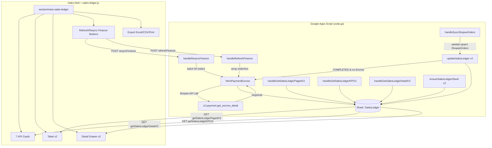
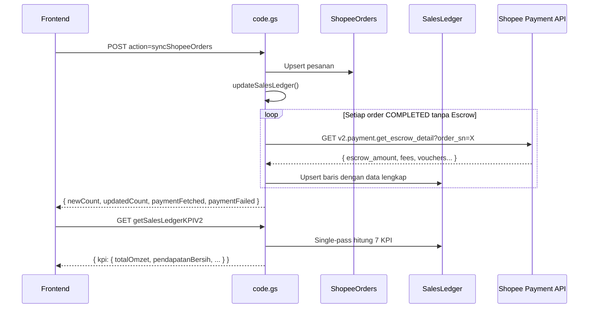

# Dokumen Desain: Laporan Penjualan v2 (Integrasi Payment API)

## Overview

Sales Ledger v2 merevisi sistem laporan penjualan ANSLA Inventaris dengan mengintegrasikan endpoint `v2.payment.get_escrow_detail` dari Shopee Payment API sebagai sumber data keuangan yang akurat. Revisi ini menggantikan kalkulasi finansial estimasi (dari ShopeeOrders) dengan data aktual escrow, meliputi voucher detail, subsidi ongkir, berbagai fee, dan escrow amount final.

Arsitektur utama:
```
ShopeeOrders (COMPLETED/TO_CONFIRM_RECEIVE)
    ↓ sync / resync
v2.payment.get_escrow_detail
    ↓ fetchPaymentEscrow()
SalesLedger v2 (schema 47 kolom)
    ↓ read-only
Frontend: KPI · Tabel · Drawer · Export
```

Payment API **hanya** dipanggil saat: (a) sync menemukan order baru yang selesai, (b) Admin klik Refresh Finance, atau (c) Admin klik Resync Finance. Frontend **tidak** pernah memanggil Payment API langsung.

---

## Architecture



### Sequence — Sync dengan Payment API



---

## Components and Interfaces

### Komponen 1: Schema & Inisialisasi SalesLedger v2

**Fungsi:** `ensureSalesLedgerSheet()`

```javascript
// Membuat atau memigrasikan sheet SalesLedger ke schema v2
// Dipanggil dari ensureDatabase()
function ensureSalesLedgerSheet() → void
```

**Tanggung Jawab:**
- Jika sheet tidak ada: buat baru dengan 47 header schema v2
- Jika sheet ada tapi hanya punya 27 kolom lama: tambahkan 20 kolom baru di sebelah kanan tanpa mengubah data
- Jika header tidak cocok dan tidak bisa dimigrasi: log error, lempar exception

---

### Komponen 2: Payment API Integration

**Fungsi:** `fetchPaymentEscrow(orderSn)`

```javascript
/**
 * Ambil detail finansial dari Shopee Payment API.
 * @param {string} orderSn - Nomor pesanan Shopee
 * @returns {{ success: boolean, data?: object, error?: string, message?: string }}
 */
function fetchPaymentEscrow(orderSn)
```

**Alur Internal:**
1. Validasi status order — jika bukan COMPLETED/TO_CONFIRM_RECEIVE, return `{ success: false, error: "invalid_status" }`
2. Panggil `getValidAccessToken()` untuk mendapatkan token yang valid
3. Buat signature: `makeShopeeSignature("/api/v2/payment/get_escrow_detail", timestamp, accessToken, shopId)`
4. Fetch ke `SHOPEE_BASE_URL + path + queryString`
5. Jika `json.error !== ""`: return `{ success: false, error, message }`
6. Jika network error: catch exception, return `{ success: false, error: "network_error", message }`
7. Sukses: return `{ success: true, data: json.response }`

**Query String yang Dibangun:**
```
partner_id=X&shop_id=Y&timestamp=Z&access_token=A&sign=B&order_sn=C
```

---

### Komponen 3: updateSalesLedger v2

**Fungsi:** `updateSalesLedger()`

```javascript
/**
 * Upsert incremental SalesLedger dari ShopeeOrders.
 * Memanggil Payment API untuk COMPLETED orders tanpa Escrow Amount.
 * @returns {{ newCount: number, updatedCount: number, paymentFetched: number, paymentFailed: number }}
 */
function updateSalesLedger()
```

**Alur Internal:**
1. Acquire `LockService.getScriptLock().waitLock(30000)`
2. Batch read ShopeeOrders sekali
3. Batch read SalesLedger sekali, build lookup map `sn_itemId_modelId → rowIndex`
4. Loop setiap baris ShopeeOrders:
   - Jika belum ada di SalesLedger: INSERT baris baru
   - Jika sudah ada: UPDATE field yang diizinkan
   - Jika status COMPLETED/TO_CONFIRM_RECEIVE DAN Escrow Amount kosong: panggil `fetchPaymentEscrow()`
5. Tulis batch ke sheet
6. Release lock
7. Return counter object

**Field yang Immutable (tidak di-overwrite saat UPDATE):**
- `Ledger ID`, `Order SN`, `Item ID`, `Model ID`, `Tanggal Order`, `Buyer Username`, `Buyer Name`

---

### Komponen 4: handleResyncFinance / handleRefreshFinance

```javascript
// Resync: cari semua COMPLETED tanpa Escrow, proses max 50 order
function handleResyncFinance(data)
  → { status, processed, success, failed, skipped }

// Refresh: proses daftar orderSns yang diberikan, max 20
function handleRefreshFinance(data)
  // data.orderSns: string[]
  → { status, processed, success, failed }
```

---

### Komponen 5: Endpoint Read v2

```javascript
// Tabel terfilter + paginasi + KPI dalam satu response
function handleGetSalesLedgerPagedV2(params)
  → { status, ledgers[], total, page, totalPages, kpi }

// KPI saja (ringan)
function handleGetSalesLedgerKPIV2(params)
  → { status, kpi: KpiObject }

// Detail satu pesanan
function handleGetSalesLedgerDetailV2(params)
  // params.ledgerId
  → { status, detail: DetailObject }
```

---

### Komponen 6: Frontend UI

```javascript
// Inisialisasi halaman — dipanggil dari switchTab/showSection
function initSalesLedger()

// Muat 7 KPI card
function loadSalesLedgerKPI()

// Muat tabel dengan paginasi
function loadSalesLedgerTable(page)

// Buka detail drawer
function openSalesLedgerDetail(encodedId)

// Tutup detail drawer
function closeSalesLedgerDetail()

// Tombol aksi baru
function resyncFinance()
function refreshFinanceSelected(orderSns)

// Badge helpers baru
function _slSettlementBadge(status)  → string (HTML)

// Export
function exportSalesLedgerExcel()
function exportSalesLedgerCSV()
function printSalesLedger()
```

---

## Data Models

### Model 1: SalesLedger v2 Schema (47 Kolom)

```javascript
const SALES_LEDGER_HEADERS_V2 = [
  // ── Kolom lama (0–26, backward-compatible) ─────────────
  "Ledger ID",           // 0  — PK: "SLv2_" + timestamp + "_" + random(4)
  "Order SN",            // 1
  "Item ID",             // 2
  "Model ID",            // 3
  "Tanggal Order",       // 4  — create_time
  "Tanggal Update",      // 5  — update_time
  "Buyer Username",      // 6
  "Buyer Name",          // 7
  "Nama Produk",         // 8
  "Variasi",             // 9
  "SKU Shopee",          // 10
  "SKU Inventaris",      // 11
  "Qty",                 // 12
  "Harga Produk",        // 13 — original_price (dari ShopeeOrders)
  "Subtotal",            // 14 — Qty × Harga Produk
  "Voucher",             // 15 — total voucher (lama, digantikan kolom baru)
  "Ongkir",              // 16 — shipping_fee lama
  "Biaya Admin",         // 17 — commission_fee lama
  "Biaya Layanan",       // 18 — service_fee lama
  "Total Dibayar",       // 19
  "Estimasi Pendapatan", // 20 — kalkulasi lama
  "Status Shopee",       // 21
  "Status Ledger",       // 22
  "Deduction Status",    // 23
  "Mapping Status",      // 24
  "Sync Time",           // 25
  "Last Modified",       // 26

  // ── Kolom baru Payment API (27–46) ──────────────────────
  "Original Price",      // 27 — items[].original_price dari Payment API
  "Selling Price",       // 28 — items[].selling_price
  "Product Subtotal",    // 29 — items[].subtotal / income_details.product_subtotal
  "Voucher Total",       // 30 — jumlah total semua voucher
  "Shopee Voucher",      // 31 — voucher_from_shopee
  "Seller Voucher",      // 32 — voucher_from_seller
  "Shop Voucher",        // 33 — coins / buyer_shopee_coins
  "Shipping Fee Buyer",  // 34 — buyer_paid_shipping_fee
  "Shipping Subsidy Shopee", // 35 — shopee_shipping_rebate
  "Shipping Subsidy Seller", // 36 — seller_return_refund (shipping)
  "Commission Fee",      // 37 — commission_fee dari Payment API
  "Service Fee",         // 38 — service_fee dari Payment API
  "Campaign Fee",        // 39 — campaign_fee (umumnya 0)
  "Transaction Fee",     // 40 — seller_transaction_fee
  "Adjustment",          // 41 — escrow_amount_after_adjustment delta
  "Refund",              // 42 — buyer_failed_delivery_return_amount
  "Other Fee",           // 43 — item lain di income_details
  "Escrow Amount",       // 44 — escrow_amount (nilai bersih)
  "Net Income",          // 45 — escrow_amount (alias, atau setelah penyesuaian internal)
  "Settlement Status",   // 46 — order_income.order_status dari Payment API
];
```

---

### Model 2: Respons `fetchPaymentEscrow` (sukses)

```javascript
// json.response dari v2.payment.get_escrow_detail
{
  order_income: {
    escrow_amount: 45000,
    voucher_amount: 5000,
    voucher_from_shopee: 3000,
    voucher_from_seller: 2000,
    coins: 0,
    buyer_shopee_coins: 0,
    shipping_fee: 10000,
    buyer_paid_shipping_fee: 0,
    shopee_shipping_rebate: 10000,
    seller_return_refund: 0,
    commission_fee: 3000,
    service_fee: 500,
    seller_transaction_fee: 250,
    seller_coin_cash_back: 0,
    final_product_price: 50000,
    final_shipping_fee: 0,
    order_status: "RELEASED"      // → Settlement Status
  },
  items: [{
    item_id: 123456,
    item_name: "Nama Produk",
    original_price: 55000,
    selling_price: 50000,
    subtotal: 50000
  }],
  income_details: []  // detail per item jika multi-item
}
```

---

### Model 3: KPI Response v2

```javascript
{
  status: "success",
  kpi: {
    totalOmzet: number,         // SUM Product Subtotal, Status Shopee=COMPLETED
    pendapatanBersih: number,   // SUM Escrow Amount, Status Shopee=COMPLETED
    totalPesanan: number,       // COUNT DISTINCT Order SN
    totalQty: number,           // SUM Qty
    voucherShopee: number,      // SUM Shopee Voucher
    voucherSeller: number,      // SUM Seller Voucher
    totalFee: number            // SUM (Commission + Service + Campaign + Transaction Fee)
  }
}
```

---

### Model 4: Detail Response v2

```javascript
{
  status: "success",
  detail: {
    // Semua 47 field dari SalesLedger
    // + field tambahan:
    buyer_avatar_initial: string,   // huruf pertama Buyer Name
    has_payment_data: boolean,      // Escrow Amount !== ""
    sections: {
      informasi_pesanan:  { order_sn, buyer_name, status_shopee, status_ledger, tanggal_order, tanggal_update },
      informasi_produk:   { nama_produk, variasi, sku_inventaris, qty, harga_produk, original_price, selling_price },
      rincian_pembayaran: { product_subtotal, shopee_voucher, seller_voucher, shop_voucher, voucher_total },
      rincian_ongkir:     { shipping_fee_buyer, shipping_subsidy_shopee, shipping_subsidy_seller },
      biaya_marketplace:  { commission_fee, service_fee, campaign_fee, transaction_fee },
      penyesuaian:        { adjustment, refund, other_fee },
      pendapatan:         { escrow_amount, net_income, settlement_status }
    }
  }
}
```

---

### Model 5: Settlement Status Badge Mapping

```javascript
const SETTLEMENT_STATUS_BADGE = {
  "RELEASED":   "ds-badge ds-badge-green",
  "IN_ESCROW":  "ds-badge ds-badge-amber",
  "BUYER_DUE":  "ds-badge ds-badge-red",
  // default:
  // ""        "ds-badge ds-badge-gray"
};
```

---

## Correctness Properties

*Properti adalah karakteristik yang harus berlaku di seluruh eksekusi sistem — jembatan antara spesifikasi yang dapat dibaca manusia dan jaminan kebenaran yang dapat diverifikasi mesin.*

### Property 1: Primary Key Unik Setelah Upsert

*Untuk setiap* array ShopeeOrders dengan N kombinasi unik `(order_sn, item_id, model_id)`, setelah `updateSalesLedger()` selesai, sheet SalesLedger harus memiliki tepat N baris tanpa duplikasi primary key — bahkan ketika fungsi dijalankan dua kali berturut-turut dengan data yang sama.

**Validates: Requirements 1.4, 3.1**

---

### Property 2: Ledger ID Format Konsisten

*Untuk setiap* baris yang di-insert ke SalesLedger, nilai `Ledger ID` harus dimulai dengan prefix `"SLv2_"`, diikuti angka (timestamp), diikuti underscore dan 4 karakter alfanumerik. Tidak boleh ada baris dengan Ledger ID kosong atau dengan format yang berbeda.

**Validates: Requirements 1.5**

---

### Property 3: fetchPaymentEscrow Menolak Status Tidak Valid

*Untuk setiap* nilai status order selain `"COMPLETED"` dan `"TO_CONFIRM_RECEIVE"`, `fetchPaymentEscrow()` harus mengembalikan objek `{ success: false, error: "invalid_status" }` tanpa melakukan HTTP request ke Shopee API.

**Validates: Requirements 2.6**

---

### Property 4: Mapping Finansial Payment API ke SalesLedger

*Untuk setiap* respons sukses dari `fetchPaymentEscrow()`, nilai yang disimpan ke kolom SalesLedger harus sesuai persis dengan field dalam `order_income` respons: `escrow_amount` → kolom `Escrow Amount`, `commission_fee` → kolom `Commission Fee`, `voucher_from_shopee` → kolom `Shopee Voucher`, dan seterusnya sesuai mapping yang didefinisikan — tidak boleh ada nilai yang tertukar atau hilang.

**Validates: Requirements 3.2**

---

### Property 5: Payment API Hanya Dipanggil untuk Baris Eligible

*Untuk setiap* array ShopeeOrders campuran (sebagian COMPLETED tanpa Escrow, sebagian sudah ada Escrow, sebagian status lain), `updateSalesLedger()` harus memanggil `fetchPaymentEscrow()` **hanya** untuk baris dengan status COMPLETED/TO_CONFIRM_RECEIVE yang Escrow Amount-nya masih kosong — tidak lebih, tidak kurang.

**Validates: Requirements 3.1, 3.7**

---

### Property 6: updateSalesLedger Selalu Mengembalikan Empat Counter

*Untuk setiap* kondisi input ShopeeOrders (array kosong, satu baris, banyak baris, semua sudah ada di SalesLedger), `updateSalesLedger()` harus selalu mengembalikan objek yang mengandung tepat 4 field: `newCount`, `updatedCount`, `paymentFetched`, `paymentFailed`, semuanya bernilai non-negatif dan `newCount + updatedCount >= paymentFetched + paymentFailed`.

**Validates: Requirements 3.6**

---

### Property 7: handleResyncFinance Hanya Memproses Baris Eligible

*Untuk setiap* SalesLedger dengan campuran baris yang sudah dan belum punya Escrow Amount, `handleResyncFinance()` harus memanggil `fetchPaymentEscrow()` **hanya** untuk baris COMPLETED/TO_CONFIRM_RECEIVE dengan Escrow Amount kosong, dan nilai `processed` dalam response harus sama dengan jumlah baris yang diproses (maksimal 50).

**Validates: Requirements 4.2, 4.3, 4.4**

---

### Property 8: Kalkulasi 7 KPI Konsisten dengan Data Mentah

*Untuk setiap* dataset SalesLedger dengan N baris, nilai 7 KPI yang dikembalikan `handleGetSalesLedgerKPIV2()` harus identik dengan hasil kalkulasi naif (iterasi satu per satu tanpa optimasi) terhadap dataset yang sama. Secara khusus: `totalOmzet` = SUM `Product Subtotal` baris COMPLETED, `pendapatanBersih` = SUM `Escrow Amount` baris COMPLETED, `totalFee` = SUM empat kolom fee.

**Validates: Requirements 7.1, 7.5**

---

### Property 9: Settlement Status Badge Selalu Valid

*Untuk setiap* nilai string Settlement Status yang mungkin (termasuk string kosong dan nilai tidak dikenal), `_slSettlementBadge()` harus mengembalikan string HTML yang mengandung class `ds-badge` dan tidak pernah mengembalikan string kosong atau `undefined`.

**Validates: Requirements 8.4**

---

### Property 10: Round-Trip Serialisasi CSV

*Untuk setiap* array nilai string arbitrer termasuk yang mengandung koma, tanda kutip ganda, newline, dan karakter Unicode, mengkodekan dengan `_toCsvRow()` kemudian mendekodekan hasilnya sesuai RFC 4180 harus menghasilkan array nilai yang setara dengan input asli.

**Validates: Requirements 11.2**

---

## Error Handling

### Skenario 1: Token Shopee Expired Saat fetchPaymentEscrow

**Kondisi:** `getValidAccessToken()` melakukan refresh yang gagal  
**Respons:** Exception dari `getValidAccessToken()` ditangkap, `fetchPaymentEscrow()` return `{ success: false, error: "auth_error", message: "..." }`  
**Recovery:** Baris SalesLedger tetap tersimpan dengan kolom finansial kosong; Admin perlu re-auth melalui halaman Pengaturan Shopee

### Skenario 2: Rate Limit Payment API

**Kondisi:** Shopee mengembalikan `error: "error_too_many_requests"` saat Resync Finance  
**Respons:** `fetchPaymentEscrow()` return `{ success: false, error: "error_too_many_requests" }`; `handleResyncFinance()` melanjutkan ke order berikutnya, menambah counter `paymentFailed`  
**Recovery:** Admin dapat menjalankan Resync Finance ulang setelah beberapa menit

### Skenario 3: Google Apps Script Timeout saat Resync Finance

**Kondisi:** Resync Finance memproses lebih dari 50 order sehingga mendekati batas 6 menit GAS  
**Respons:** Fungsi dibatasi maksimal 50 order per eksekusi; setelah 50 order diproses, fungsi return dengan `skipped = totalEligible - 50`  
**Recovery:** Admin menjalankan ulang Resync Finance untuk memproses batch berikutnya

### Skenario 4: fetchPaymentEscrow Gagal untuk Order Tertentu

**Kondisi:** API error atau network error untuk satu order saat `updateSalesLedger()`  
**Respons:** Baris SalesLedger tetap tersimpan dengan kolom Payment API kosong; error dicatat ke log; proses dilanjutkan untuk order berikutnya  
**Recovery:** Tidak diperlukan — Admin dapat menggunakan Refresh Finance untuk order tersebut

### Skenario 5: SalesLedger Memiliki Header v1 (27 Kolom)

**Kondisi:** Sheet SalesLedger sudah ada dengan schema lama 27 kolom  
**Respons:** `ensureSalesLedgerSheet()` menambahkan 20 kolom baru di sebelah kanan kolom 26 tanpa mengubah data yang ada  
**Recovery:** Otomatis; tidak memerlukan intervensi Admin

### Skenario 6: Resync Finance pada SalesLedger Kosong

**Kondisi:** `handleResyncFinance()` dipanggil saat tidak ada baris COMPLETED yang eligible  
**Respons:** Return `{ status: "success", processed: 0, message: "Semua pesanan sudah memiliki data finance." }`  
**Recovery:** Tidak diperlukan

---

## Testing Strategy

### Pendekatan Pengujian

Fitur ini menggunakan pendekatan dual testing:
- **Unit test (contoh spesifik):** untuk error handling, routing endpoint, dan skenario edge case
- **Property-based test:** untuk invariant dan logika yang bervariasi dengan input

Library PBT yang digunakan: **fast-check** (JavaScript, tersedia via npm untuk test runner lokal)

### Property Test Configuration

Setiap property test dikonfigurasi dengan minimum **100 iterasi**. Setiap test diberi tag:
`// Feature: sales-ledger-v2, Property N: [teks property]`

### Cakupan Unit Test

- `fetchPaymentEscrow()` dengan mock HTTP: test error parsing, sukses, network error
- `handleResyncFinance()` batas 50 order
- `handleRefreshFinance()` validasi parameter `orderSns`
- Routing `doPost`/`doGet` untuk 5 endpoint baru
- Empty state frontend: dataset kosong → tampilkan `.ds-empty`
- Detail drawer: data tanpa Escrow → tampilkan pesan "Data belum tersedia"

### Cakupan Integration Test

- End-to-end: sync pesanan → `fetchPaymentEscrow()` → verifikasi data di SalesLedger
- Verifikasi semua 5 endpoint baru dapat dipanggil via GAS URL

### Cakupan Smoke Test

- `ensureSalesLedgerSheet()` membuat sheet dengan 47 header benar
- `ensureSalesLedgerSheet()` pada sheet v1 (27 kolom) menambahkan 20 kolom baru tanpa merusak data
