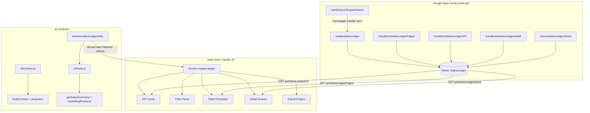
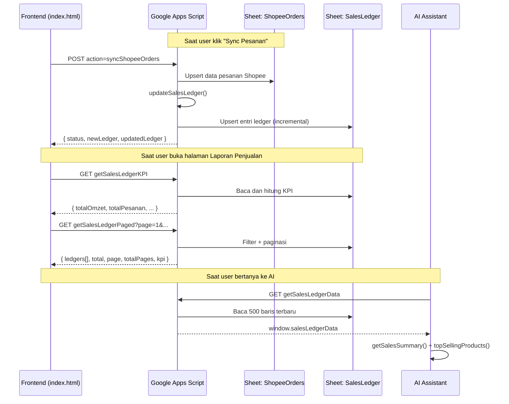

# Dokumen Desain: Sales Ledger (Laporan Penjualan)

## Overview

Sales Ledger adalah fitur pencatatan penjualan terpusat yang secara otomatis mengubah data mentah dari sheet `ShopeeOrders` menjadi entri buku penjualan terstruktur di sheet `SalesLedger`. Fitur ini menyediakan halaman laporan penjualan lengkap dengan KPI dashboard, filter multidimensi, ekspor data, dan integrasi AI Assistant yang membaca langsung dari `SalesLedger`.

Aliran data utama:
```
Shopee Open API → handleSyncShopeeOrders() → ShopeeOrders (Raw)
                                                    ↓
                                          updateSalesLedger()
                                                    ↓
                                          SalesLedger (Sheet)
                                                    ↓
                                    UI Laporan Penjualan + AI Assistant
```

Phase 1 mencakup pembuatan ledger otomatis, halaman laporan, KPI, ekspor, dan integrasi AI. Fitur HPP, margin, laba, dan akuntansi tidak termasuk di Phase 1.

---

## Architecture



### Aliran Data Utama



---

## Components and Interfaces

### Komponen 1: Ledger System (Backend — `code.gs`)

**Tujuan:** Mengelola sheet `SalesLedger` — inisialisasi, upsert, dan pembacaan terfilter.

**Interface:**

```javascript
// Inisialisasi sheet (dipanggil dari ensureDatabase())
function ensureSalesLedgerSheet()

// Upsert incremental setelah sync Shopee (dipanggil dari handleSyncShopeeOrders)
function updateSalesLedger() → { newCount: number, updatedCount: number }

// Helper pemetaan status (pure function)
function _mapShopeeStatusToLedger(statusShopee: string) → string

// Endpoint GET: data tabel terfilter + paginasi + KPI
function handleGetSalesLedgerPaged(params) → SalesLedgerPagedResponse

// Endpoint GET: KPI saja (ringan)
function handleGetSalesLedgerKPI(params) → SalesLedgerKPIResponse

// Endpoint GET: detail satu entri ledger
function handleGetSalesLedgerDetail(params) → SalesLedgerDetailResponse

// Endpoint GET: data untuk AI (maks 500 baris)
function handleGetSalesLedgerData(params) → SalesLedgerDataResponse
```

**Tanggung Jawab:**
- Membuat sheet `SalesLedger` dengan 27 kolom header jika belum ada
- Menjaga konsistensi primary key (`Order SN + Item ID + Model ID`)
- Menghitung `Subtotal` dan `Estimasi Pendapatan` saat insert
- Mengamankan operasi tulis dengan `LockService`
- Memetakan `Status Shopee` → `Status Ledger` secara deterministik

---

### Komponen 2: Sales Ledger UI (Frontend — `index.html`)

**Tujuan:** Halaman laporan penjualan lengkap dengan filter, tabel, KPI, drawer, dan ekspor.

**Interface (fungsi JavaScript global):**

```javascript
// Muat dan tampilkan halaman (dipanggil dari showSection)
function initSalesLedger()

// Muat data KPI ke 5 card
function loadSalesLedgerKPI()

// Muat data tabel dengan paginasi
function loadSalesLedgerTable(page: number)

// Buka detail drawer untuk satu entri
function openSalesLedgerDetail(ledgerId: string)

// Tutup detail drawer
function closeSalesLedgerDetail()

// Ekspor semua data sesuai filter ke Excel
function exportSalesLedgerExcel()

// Ekspor semua data sesuai filter ke CSV
function exportSalesLedgerCSV()

// Print laporan
function printSalesLedger()

// Helper: render badge Status Ledger
function _slStatusLedgerBadge(status: string) → string (HTML)

// Helper: render badge Deduction Status
function _slDeductionBadge(status: string) → string (HTML)

// Helper: encode satu baris ke CSV sesuai RFC 4180
function _toCsvRow(values: string[]) → string
```

**Tanggung Jawab:**
- Menampilkan 5 KPI card dengan data terkini
- Filter multidimensi: periode, status Shopee, status ledger, pencarian teks, SKU
- Tabel terfilter dengan paginasi server-side (25/50/100 per halaman)
- Detail drawer dengan breakdown finansial lengkap
- Ekspor Excel, CSV, dan Print

---

### Komponen 3: AI Sales Tools (`ai/AITools.js`)

**Tujuan:** Menyediakan tool yang membaca `window.salesLedgerData` untuk AI context.

**Interface:**

```javascript
// Ringkasan statistik penjualan
export function getSalesSummary() → SalesSummary

// Produk terlaris berdasarkan subtotal
export function topSellingProducts(topN: number = 5) → { products: TopProduct[] }
```

**Tanggung Jawab:**
- Membaca dari `window.salesLedgerData` (bukan `window.shopeeOrdersFullData`)
- Menghitung agregat: omzet, pesanan selesai, retur, pembatalan, estimasi pendapatan
- Mengidentifikasi top produk berdasarkan subtotal pesanan selesai

---

### Komponen 4: AI Context Update (`ai/AIContext.js`)

**Tujuan:** Menyertakan data penjualan dari Sales Ledger ke dalam context AI.

**Perubahan pada `buildContext()`:**
- Import `getSalesSummary` dari `AITools.js`
- Tambah field `context.penjualan` dengan ringkasan penjualan

**Perubahan pada `contextToText()`:**
- Tambah section `--- PENJUALAN (SALES LEDGER) ---` ke teks output

---

## Data Models

### Model 1: SalesLedger Row (27 kolom)

```javascript
const SALES_LEDGER_HEADERS = [
  "Ledger ID",           // 0  — PK: "SL_" + Date.now() + "_" + random(4)
  "Order SN",            // 1  — Nomor pesanan Shopee
  "Item ID",             // 2  — Item ID Shopee
  "Model ID",            // 3  — Model/variasi ID Shopee
  "Tanggal Order",       // 4  — create_time (Date object)
  "Tanggal Update",      // 5  — update_time (Date object)
  "Buyer Username",      // 6  — buyer_username
  "Buyer Name",          // 7  — recipient_address.name
  "Nama Produk",         // 8  — item_name
  "Variasi",             // 9  — model_name
  "SKU Shopee",          // 10 — model_sku
  "SKU Inventaris",      // 11 — inventory_sku (dari ShopeeMapping)
  "Qty",                 // 12 — item_quantity
  "Harga Produk",        // 13 — original_price
  "Subtotal",            // 14 — Qty × Harga Produk
  "Voucher",             // 15 — voucher_from_seller + voucher_from_shopee
  "Ongkir",              // 16 — shipping_fee
  "Biaya Admin",         // 17 — commission_fee
  "Biaya Layanan",       // 18 — service_fee
  "Total Dibayar",       // 19 — total_amount
  "Estimasi Pendapatan", // 20 — Subtotal - Voucher - Biaya Admin - Biaya Layanan
  "Status Shopee",       // 21 — order_status dari API
  "Status Ledger",       // 22 — pemetaan internal
  "Deduction Status",    // 23 — deduction_status dari ShopeeOrders
  "Mapping Status",      // 24 — mapping_status dari ShopeeOrders
  "Sync Time",           // 25 — waktu terakhir sync
  "Last Modified"        // 26 — waktu baris ini terakhir diperbarui
];
```

**Aturan Validasi:**
- `Ledger ID` tidak boleh null atau kosong; format: `SL_[timestamp]_[4char]`
- Primary key (`Order SN + Item ID + Model ID`) harus unik di seluruh sheet
- `Subtotal` harus = `Qty × Harga Produk` (dihitung otomatis, tidak dari input manual)
- `Estimasi Pendapatan` harus = `Subtotal - Voucher - Biaya Admin - Biaya Layanan`

---

### Model 2: Pemetaan Status Shopee → Status Ledger

```javascript
const STATUS_LEDGER_MAP = {
  "UNPAID":             "Pending",
  "READY_TO_SHIP":      "Pending",
  "SHIPPED":            "Pending",
  "TO_CONFIRM_RECEIVE": "Pending",
  "COMPLETED":          "Selesai",
  "CANCELLED":          "Dibatalkan",
  "IN_CANCEL":          "Dibatalkan",
  "TO_RETURN":          "Retur",
  "RETURNED":           "Retur",
};
// Default untuk status tidak dikenal: "Pending"
```

---

### Model 3: Badge Status (Frontend)

```javascript
// Status Ledger → CSS class badge
const BADGE_STATUS_LEDGER = {
  "Pending":    "ds-badge ds-badge-amber",
  "Selesai":    "ds-badge ds-badge-green",
  "Dibatalkan": "ds-badge ds-badge-red",
  "Retur":      "ds-badge ds-badge-purple",
};

// Deduction Status → CSS class badge
const BADGE_DEDUCTION = {
  "DEDUCTED":          "ds-badge ds-badge-green",
  "SUCCESS":           "ds-badge ds-badge-green",
  "WAITING_APPROVAL":  "ds-badge ds-badge-amber",
  "PENDING":           "ds-badge ds-badge-gray",
  "FAILED":            "ds-badge ds-badge-red",
  "SKIPPED":           "ds-badge ds-badge-gray",
  "RETURN_PENDING":    "ds-badge ds-badge-purple",
};
```

---

### Model 4: Response API

```javascript
// GET getSalesLedgerPaged
{
  status: "success",
  ledgers: LedgerRow[],
  total: number,
  page: number,
  totalPages: number,
  kpi: {
    totalOmzet: number,
    totalPesanan: number,
    totalQty: number,
    averageOrder: number,
    totalRetur: number,
    totalDibatalkan: number,
    totalSelesai: number,
    totalPending: number,
    estimasiPendapatan: number
  }
}

// GET getSalesLedgerKPI
{
  status: "success",
  kpi: { /* same as above */ }
}

// GET getSalesLedgerDetail
{
  status: "success",
  detail: {
    /* semua 27 field */
    buyer_avatar_initial: string,
    financial_breakdown: {
      subtotal: number,
      voucher: number,       // nilai negatif
      biaya_admin: number,   // nilai negatif
      biaya_layanan: number, // nilai negatif
      estimasi_pendapatan: number
    }
  }
}

// GET getSalesLedgerData (untuk AI)
{
  status: "success",
  ledgers: LedgerRow[],  // maks 500 baris
  summary: {
    totalBaris: number,
    diambil: number,
    lastSync: string  // ISO datetime
  }
}
```

---

## Error Handling

### Skenario 1: Sheet SalesLedger Tidak Ada

**Kondisi:** Sheet `SalesLedger` belum pernah dibuat  
**Respons:** `ensureSalesLedgerSheet()` membuat sheet baru dengan 27 header secara otomatis  
**Recovery:** Operasi write dilanjutkan setelah sheet berhasil dibuat

### Skenario 2: Header Sheet Tidak Sesuai Schema

**Kondisi:** Sheet `SalesLedger` ada tapi header berbeda dari `SALES_LEDGER_HEADERS`  
**Respons:** Melempar `Error("Header SalesLedger tidak cocok dengan schema")` dan menghentikan operasi  
**Recovery:** Admin menghapus sheet secara manual lalu jalankan ulang `ensureDatabase()`

### Skenario 3: `ledgerId` Tidak Ditemukan

**Kondisi:** `getSalesLedgerDetail` dipanggil dengan `ledgerId` yang tidak ada  
**Respons:** `{ status: "error", message: "Ledger tidak ditemukan." }`  
**Recovery:** Frontend menampilkan toast error, drawer tidak dibuka

### Skenario 4: Race Condition Sync Paralel

**Kondisi:** Dua request `syncShopeeOrders` berjalan bersamaan  
**Respons:** `LockService.getScriptLock().waitLock(30000)` memblokir request kedua  
**Recovery:** Request kedua berjalan setelah lock dilepas dengan `updatedCount > 0`, `newCount = 0`

### Skenario 5: ShopeeOrders Kosong

**Kondisi:** Sheet `ShopeeOrders` hanya memiliki header tanpa data  
**Respons:** `updateSalesLedger()` mengembalikan `{ newCount: 0, updatedCount: 0 }` tanpa error  
**Recovery:** Tidak diperlukan

---

## Testing Strategy

### Unit Testing

Fungsi helper murni (`_mapShopeeStatusToLedger`, formula finansial, `_toCsvRow`, `_slStatusLedgerBadge`) diuji dengan contoh spesifik untuk memverifikasi perilaku dan kasus tepi.

### Property-Based Testing

Library: **fast-check** untuk frontend JavaScript; manual property loops untuk GAS.

Property test difokuskan pada:
- Pemetaan status (deterministik untuk semua input)
- Formula finansial (kebenaran matematis)
- Filter tabel (semua hasil memenuhi semua kondisi)
- CSV round-trip (serialize lalu deserialize menghasilkan data setara)
- Paginasi (batas atas baris per halaman)
- Idempoten upsert (tidak ada duplikasi saat dijalankan ulang)

### Integration Testing

1. Jalankan `handleSyncShopeeOrders` dari GAS Editor
2. Verifikasi data muncul di sheet `SalesLedger`
3. Panggil endpoint `getSalesLedgerPaged` dan verifikasi response
4. Buka halaman di browser dan verifikasi tampilan UI

---

## Correctness Properties

*Properti adalah karakteristik yang harus berlaku di seluruh eksekusi sistem — jembatan antara spesifikasi yang dapat dibaca manusia dan jaminan kebenaran yang dapat diverifikasi.*

### Property 1: Primary Key Unik di SalesLedger

*Untuk setiap* pasangan (Order SN, Item ID, Model ID), harus ada tepat satu baris di sheet SalesLedger setelah operasi `updateSalesLedger()` selesai.

**Validates: Requirements 1.2**

### Property 2: Konsistensi Pemetaan Status

*Untuk setiap* nilai Status Shopee yang mungkin, `_mapShopeeStatusToLedger()` harus mengembalikan nilai Status Ledger yang valid (`Pending`, `Selesai`, `Dibatalkan`, `Retur`) sesuai tabel pemetaan yang didefinisikan, dan tidak pernah mengembalikan nilai di luar daftar tersebut.

**Validates: Requirements 1.4**

### Property 3: Kebenaran Perhitungan Finansial

*Untuk setiap* kombinasi `(qty, hargaProduk)` dengan nilai positif, `Subtotal` yang tersimpan harus selalu sama dengan `qty × hargaProduk`.

**Validates: Requirements 1.5**

### Property 4: Estimasi Pendapatan Konsisten

*Untuk setiap* baris SalesLedger, nilai `Estimasi Pendapatan` harus selalu sama dengan `Subtotal - Voucher - Biaya Admin - Biaya Layanan`.

**Validates: Requirements 1.5**

### Property 5: Idempoten Sync

*Menjalankan* `updateSalesLedger()` dua kali berturut-turut tanpa mengubah ShopeeOrders harus menghasilkan jumlah baris SalesLedger yang sama (tidak ada duplikasi) dan nilai field immutable (`Ledger ID`, `Tanggal Order`, `Buyer Username`, `Buyer Name`) yang tidak berubah.

**Validates: Requirements 1.2, 1.3**

### Property 6: KPI Mencerminkan Data Sheet

*Untuk setiap* periode filter yang diberikan, nilai `totalOmzet` yang dikembalikan `getSalesLedgerKPI` harus sama dengan SUM kolom Subtotal dari semua baris SalesLedger dalam periode tersebut dengan Status Ledger = "Selesai".

**Validates: Requirements 2.1, 6.2**

### Property 7: Filter Tidak Menghasilkan Data di Luar Kriteria

*Untuk setiap* kombinasi filter yang diterapkan (statusShopee, statusLedger, dateFrom, dateTo, search), semua baris dalam `ledgers[]` yang dikembalikan `getSalesLedgerPaged` harus memenuhi **semua** kondisi filter secara bersamaan.

**Validates: Requirements 2.2, 6.1**

### Property 8: Round-Trip Serialisasi CSV

*Untuk setiap* array nilai string arbitrer (termasuk yang mengandung koma, tanda kutip, dan newline), mengkodekan dengan `_toCsvRow()` kemudian mendekodekan hasilnya harus menghasilkan array nilai yang setara dengan input asli.

**Validates: Requirements 3.2, 3.4**

---

## Pertimbangan Performa

- `updateSalesLedger()` menggunakan **batch read satu kali** dari ShopeeOrders, identik dengan pola di `handleGetShopeeOrdersPaged` yang sudah ada
- Lookup existing SalesLedger menggunakan **Map JavaScript** keyed by `sn_itemId_modelId` untuk O(1) lookup per baris
- `handleGetSalesLedgerPaged` menggunakan **single-pass filter** untuk menghindari iterasi berganda
- KPI dihitung **inline** dalam single-pass yang sama untuk efisiensi maksimal
- Data untuk AI (`getSalesLedgerData`) dibatasi **500 baris terbaru** untuk menjaga ukuran payload tetap kecil

---

## Pertimbangan Keamanan

- Semua endpoint GAS menggunakan pola autentikasi yang sama dengan endpoint yang sudah ada (tidak ada perubahan auth)
- Data finansial agregat (bukan transaksi individual) yang dikirim ke AI untuk meminimalkan eksposur data sensitif
- `LockService.getScriptLock()` digunakan dalam `updateSalesLedger()` untuk mencegah race condition

---

## Dependensi

| Dependensi | Sumber | Keterangan |
|---|---|---|
| Google Apps Script Runtime V8 | Bawaan GAS | Backend |
| Google Sheets | Bawaan GAS | Database |
| Tailwind CSS | CDN (sudah ada di index.html) | Styling |
| Phosphor Icons | CDN (sudah ada di index.html) | Ikon |
| SheetJS (xlsx) | `cdn.sheetjs.com` (perlu ditambahkan) | Export Excel |
| Vanilla JavaScript ES2020 | Bawaan browser | Frontend logic |
